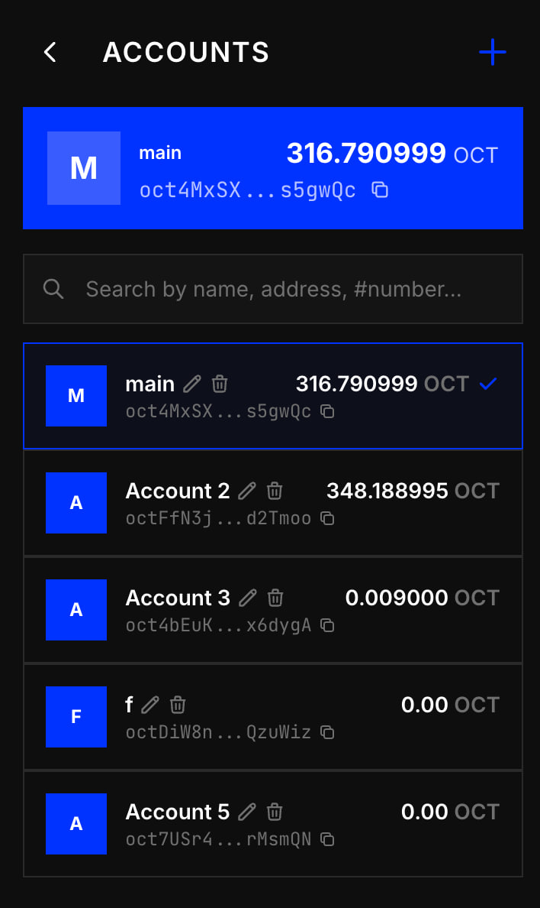
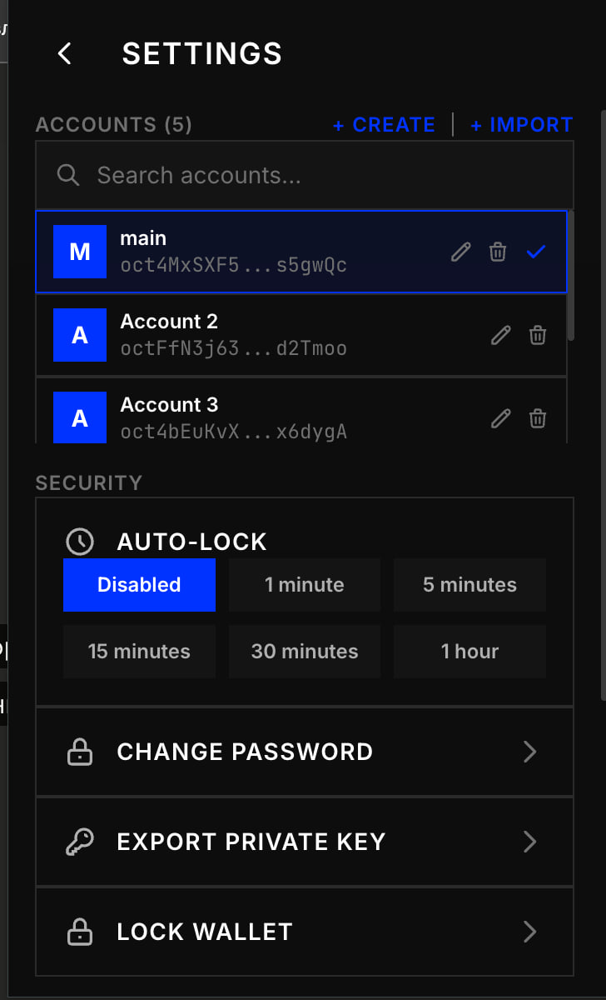
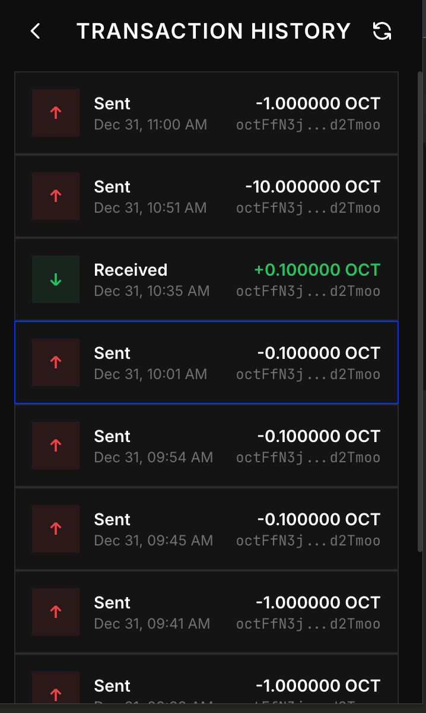
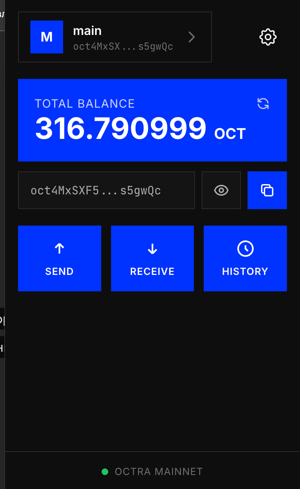

# Octra Wallet

Browser wallet extension for [Octra Network](https://octra.org/).

<p>
  
  
  
  
</p>

## Quick Install

```bash
# clone and build
git clone https://github.com/lokert31/octra-wallet.git
cd octra-wallet
npm install
npm run build
```

Then load `dist/` folder as unpacked extension:
- Chrome: `chrome://extensions/` → Developer mode → Load unpacked
- Brave: `brave://extensions/` → Developer mode → Load unpacked
- Edge: `edge://extensions/` → Developer mode → Load unpacked

## Download

Pre-built extension from [Releases](https://github.com/lokert31/octra-wallet/releases) or build from source:

```bash
git clone https://github.com/lokert31/octra-wallet.git
cd octra-wallet
npm install && npm run build
```

## Features

- Create wallet with 12-word seed phrase
- Import wallet (mnemonic / private key)
- Multiple accounts
- Send/receive OCT
- Transaction history
- Auto-lock

## License

MIT
